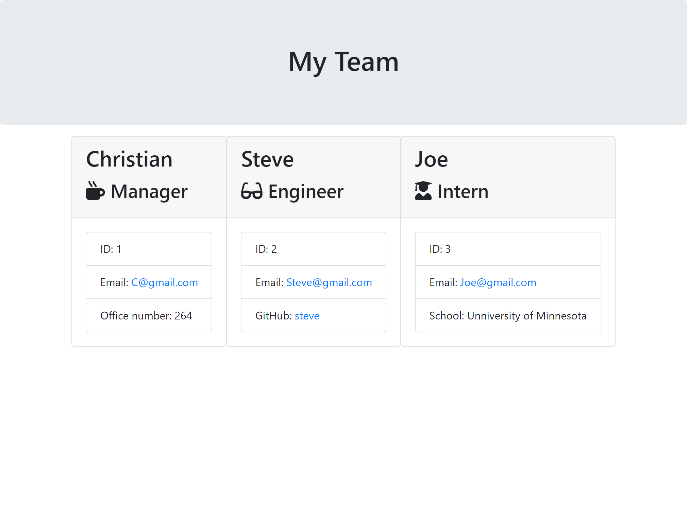

# Team-Generator
  
## My story
* This project enabled me to better understand how to utilize and build constructors
* This project enables a user to quickly build a team template with important information
* I have a better understanding on how exports and require work
* Better understanding on how inquirer prompts work
* Several inquirer prompts can be linked together after the .then function has been fulfilled
## Features ##
* An output folder will be created for you if you forget to create your own. The output folder is where your dynamically created html file will be placed.
* Allows the user to add any number of employees they desire
* Certain questions will only be displayed based upon what role they have selected for an employee
* Allows the user to simply fill in information in the commmand line and have an html page built just for them!
## Installation ##
1. Open up git bash terminal
2. Change directory to desired location (%User Profile%/SourceRepo)
3. Clone the repository (git clone git@github.com:ChristianGoldman/Team-Generator.git)
## Usage ##
1. Open up git bash terminal
2. Change directory to the cloned repo
3. Navigate to the Team-Generator folder
4. In the command line run "npm install"
5. In the commmand line run "node app.js"
6. In the command line fill out all relevant questions
7. Once you have filled out all the questions you should see a Generated HTML file with all the corresponding information. It should look something like this.

## Credits ##
* Cwerness gitlab
* https://www.w3schools.com/js/default.asp
* Tutor Makism
* BCA learning assistants
* TA's Paul Hendrickson, Tommy Boone, Jake O'Thoole, Daniel Thao
## Link to ReadMe Generator walkthrough video ##
* [Youtube Walkthrough](https://www.youtube.com/watch?v=8XeiHgPI8a4&feature=youtu.be)
## License ##
    MIT License

    Copyright (c) [2020] [Christian Goldman]

    Permission is hereby granted, free of charge, to any person obtaining a copy
    of this software and associated documentation files (the "Software"), to deal
    in the Software without restriction, including without limitation the rights
    to use, copy, modify, merge, publish, distribute, sublicense, and/or sell
    copies of the Software, and to permit persons to whom the Software is
    furnished to do so, subject to the following conditions:

    The above copyright notice and this permission notice shall be included in all
    copies or substantial portions of the Software.

    THE SOFTWARE IS PROVIDED "AS IS", WITHOUT WARRANTY OF ANY KIND, EXPRESS OR
    IMPLIED, INCLUDING BUT NOT LIMITED TO THE WARRANTIES OF MERCHANTABILITY,
    FITNESS FOR A PARTICULAR PURPOSE AND NONINFRINGEMENT. IN NO EVENT SHALL THE
    AUTHORS OR COPYRIGHT HOLDERS BE LIABLE FOR ANY CLAIM, DAMAGES OR OTHER
    LIABILITY, WHETHER IN AN ACTION OF CONTRACT, TORT OR OTHERWISE, ARISING FROM,
    OUT OF OR IN CONNECTION WITH THE SOFTWARE OR THE USE OR OTHER DEALINGS IN THE
    SOFTWARE.